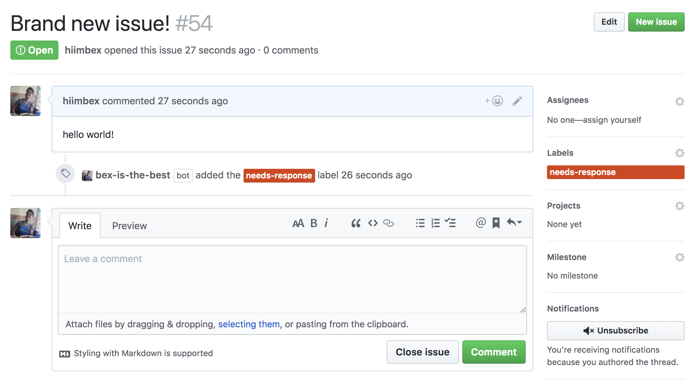

# Building Your First GitHub App - JavaScript

{:toc}

## Introduction

This guide is designed to help you build a GitHub App and run it on a server. The app will be simple: it will add a label to any new issue that's opened in a repository the app is installed on.

This project will walk you through the following:

* Registering a GitHub App
* Exposing your local environment to the internet via smee
* Programming your app to listen for events
* Authenticate via Probot
* Using the Octokit.js library to do REST API operations through Probot

Once you've worked through the steps, you'll be ready to develop other kinds of integrations using the full suite of GitHub APIs. You can check out successful examples of apps on [GitHub Marketplace](https://github.com/marketplace) and [Works with GitHub](https://github.com/works-with).

### Prior knowledge needed

You may find it helpful to have a basic understanding of the following:

* [GitHub Apps](/apps/about-apps)
* [Webhooks](/webhooks)
* The JavaScript programming language (there's no official link)
* [REST APIs](/v3)

But you can follow along at any experience level. We'll link out to information you need along the way!

## One-time setup

You'll need to complete the following tasks as part of the one-time setup for this project:

* [Initial Setup using Probot](#initial-setup)
* [Register a new app with GitHub](#register-a-new-app-with-github)
* [Setup smee](#setup-smee)
* [Fill in your environment variables](#fill-in-your-environment-variables)
* [Run the boilerplate](#run-the-boilerplate)
* [Install the app on your account](#install-the-app-on-your-account)

Once you've completed these steps, you can start [building your app](#build-the-app)!

## Initial Setup

For now, let's assume we are going to develop our app on your local machine, at least to start. We'll be able to move everything onto proper
servers later, but it'll be easier to start with the machine in front of us.

In order to develop a GitHub App in JavaScript, we're going to use a framework called [Probot][probot] to help simplify this process.

The first thing we'll need to do is ensure that you have node and npm installed on your computer.
Run `node -v` in your terminal to check if you are on at least version 8.3.0. If not, [install the latest version](https://nodejs.org/).

The best way to get started using [probot][probot] is to use [create-probot-app](https://github.com/probot/create-probot-app) to generate some boilerplate
files in order to more easily get started on your app. We'll use npm to run:

`$ npx create-probot-app my-first-app`

This will ask you a series of optional questions about your new app which will look like:


This will create a new folder `my-first-app`, which we will navigate into on our terminal.
The most important files note here are `index.js`, which is where the code for your app will go, and `package.json`,
which makes this a standard [npm module](https://docs.npmjs.com/files/package.json).

## Setup smee

To help GitHub connect to your local computer, to talk to our app, we're going to use a tool called [smee][smee].
(Of course, if you're already familiar with smee or other similar tools like localtunnel or ngrok, feel free to use what you are comfortable with.)

Now we are going to run smee. Go to [smee.io](https://smee.io) and click Start a new channel. smee will assign us a
unique domain that we can use. We will
need to know this domain for the next step. In this example above, we'll use `https://smee.io/hello-world` as the domain.

## Registering a new app with GitHub

Now, we need to tell GitHub about our app. For now, we'll use the domain smee provided, but in the future we can update GitHub to point to
our hosting provider. (If at this point you do not yet have a GitHub account, now would be a [great time to join](https://github.com/join).)

Begin by visiting the [app settings page][app settings] in your GitHub profile, navigate to GitHub Apps,
and click the "New GitHub App" button to begin registering our app with GitHub.

From here we will be presented with a form to fill out, giving GitHub the details on our new app.
[Follow this guide][creating a github app] for the details on what each field is and requires, but for this guide we have some specific
requirements for how it should be filled out.

* Use the domain issued to us by smee.

* Create a secret to secure our webhook endpoints. This should be something that only you (and GitHub, via this form) know.
For local development, we recommend using 'development'.


* We must specify a set of permissions for our app—that is, how much data it should have access to. Let's begin with the bare minimum, and
select nothing at all. We'll add permissions as we need them in later guides.

Once you've submitted the form, we'll be taken to the app management page. We have two more things we need to look at.

1. First, be sure to generate a private key for our app. This is necessary for us to authenticate our app later. Hit the green button in
the screenshot, and save the file in your my-first-probot-app folder.


2. Second, take note of the App ID that GitHub assigns us. It might not look important, but in fact we'll need it so we can tell GitHub who
we are from our app.


OK, that's everything we need from the GitHub site! Let's start playing with code!

## Fill in your environment variables

All the things necessary to run your GitHub App will live in a `.env` file, which is how nodejs handles environment variables. In your my-first-probot-app folder, you should see a file called `.env.example`. Let's go ahead and rename this file to `.env`. From there we need to add two important variables.

1. Fill in the `APP_ID=` and set it to the App ID GitHub gave you.

2. Fill in the `WEBHOOK_PROXY_URL=` with the domain generated on smee.

In my case, my `.env` will look like:
```env
# The ID of your GitHub App
APP_ID=1234
WEBHOOK_SECRET=development

# Use `trace` to get verbose logging or `info` to show less
LOG_LEVEL=debug

# Go to https://smee.io/new set this to the URL that you are redirected to.
WEBHOOK_PROXY_URL='https://smee.io/hello-world'
```

{{#note}}

**Note**: Probot automatically sets `WEBHOOK_SECRET` to development in its boilerplate, if you set it to something different, be sure to update your `.env` to reflect that.

{{/note}}

Great! Now we've got our environment prepped. Let's run the app!

## Run the boilerplate

Now, for one last test. We're going to start our server by running:
```bash
$ npm start
```
 and watching at the output in your terminal. You should see something like this:


That's good news! It means our app was able to successfully authenticate and recieve an access token from GitHub. If you saw something like this,
we're good to go! 🙌

# Building your App

The remainder of this guide walks you through customizing this code so that the app does what you want: when someone opens a new issue in a repo that the app is installed on, the app automatically adds the label `needs-response` to it.

The following sections will walk you through these procedures:

* [Update App permissions](#update-app-permissions)
* [Add labels to new issues](#add-labels-to-new-issue)


## Update App permissions

When you [first registered your app](#register-a-new-app-with-github), you accepted the default permissions, which amount to "no access" for most operations.

But your app is going to need permission to read issues and write labels. To update its permissions, return to the [app settings page](https://github.com/settings/apps), choose your app, and click **Permissions & Webhooks** in the sidebar.

* In the permissions section, find **Issues**, and select **Read & Write** in the Access dropdown next to it. The description says this option grants access to both issues and labels, which is just what you need.
* In the events section, subscribe to **Issues** events.

Save your changes!

{{#note}}

**Note:** Any time you change your app's permissions or webhooks, users who have installed the app (including yourself!) will need to accept the new permissions before the changes take effect. Users who have installed the app will receive an email prompting them to accept the new permissions. Make sure to check your own email and follow the link to accept the new permissions.

{{/note}}

Great! Your app has permission to do the tasks you want it to do. Now you can add the code to make it work.

## Add labels to new issues

OK, your app can tell when issues are opened. Now you want the app to add the label `needs-response` to any newly opened issue.

First, create the label. For the purposes of this guide, create the label manually via the GitHub website. In your repository, click **Issues**, then **Labels**, then click the **New label** button. Name the new label `needs-response`.

{{#note}}

**Note**: Wouldn't it be great if your app could create the label programmatically? [It can](/v3/issues/labels/#create-a-label)! Try adding the code to do that on your own after you finish the steps in this guide.

{{/note}}

Now that the label exists, you can program your app to use the REST API to [add the label to any newly opened issue](/v3/issues/labels/#add-labels-to-an-issue).

We already know that Probot handles the authentication side of things, but what Probot also does is pass in an authenticated octokit instance in the form of `context.github` that allows you to utilize GitHub's REST API.

Now we can copy this code into our `index.js`:
```js
module.exports = robot => {
  robot.on('issues.opened', check)
  async function check (context) {
    await context.github.issues.addLabels(context.issue({ labels: ['needs-response'] }))
  }
}
```

Now we can install the app on any repository, and any time a new issue is opened, it will add the label 'needs-response' to all newly opened issues, like so:



## Conclusion

After walking through this guide, you've learned the basic building blocks for developing GitHub Apps! To review, you:

* Registered a new GitHub App
* Exposed your local environment to the internet via smee
* Programmed your app to listen for events
* Used the Octokit.js library to do REST API operations
* Authenticated via Probot

## Next steps

Here are some ideas for what you can do next with your app:


* [Rewrite your app using GraphQL](/changes/2018-04-30-graphql-supports-github-apps/)!
* Rewrite your app in Ruby using TODO: LINK TO RUBY GUIDE
* Have the app check whether the `needs-response` label already exists on the issue, and if not, add it.
* When the bot successfully adds the label, show a message in the Terminal. (Hint: compare the `needs-response` label ID with the ID of the label in the payload as a condition for your message, so that the message only displays when the relevant label is added and not some other label.)
* Move your code to a hosted server (e.g., Heroku). Don't forget to update your app settings with the new domain.
* Share your project or get advice in the Community Forum: _LINK TO COME_
* Have you developed a shiny new app you think others might find useful? [Add it to GitHub Marketplace](/apps/marketplace/creating-and-submitting-your-app-for-approval/)!

[app guides] /apps/guides/
[probot]: https://probot.github.io/
[smee]: https://smee.io/
[app settings]: https://github.com/settings/apps
[creating a github app]: https://developer.github.com/apps/building-github-apps/creating-a-github-app/
