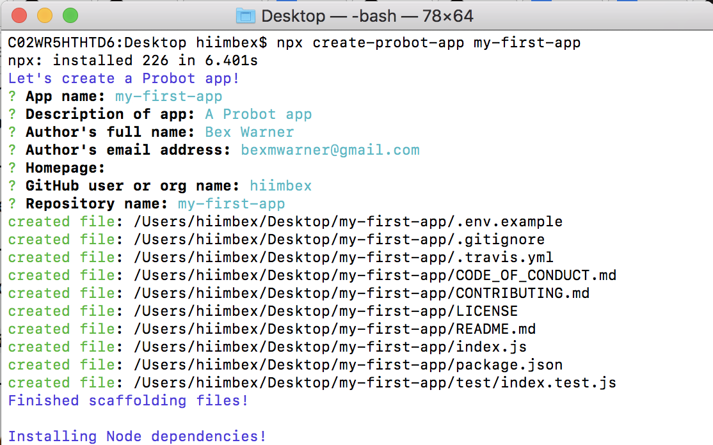

# Building Your First GitHub App

{:toc}

This guide is designed to help you get up and running with the backbone for your own GitHub App in JavaScript. The App we are going to get running won't
do much beyond connect to GitHub. It represents the kind of baseline functionality that you'll need to build something functional. It's the
first step, but it's only the first step.

Once you've worked through this guide, you'll be ready to take the code, and flesh it out into something awesome by taking one of the other
projects in our [app guides][app guides], which are designed to orient you around the various features of the GitHub API.

## Initial Setup

For now, let's assume we are going to develop our app on your local machine, at least to start. We'll be able to move everything onto proper
servers later, but it'll be easier to start with the machine in front of us.

In order to develop a GitHub App in JavaScript, we're going to use a framework called [Probot][probot] to help simplify this process.

The first thing we'll need to do is ensure that you have node and npm installed on your computer.
Run `node -v` in your terminal to check if you are on at least version 8.3.0. If not, [install the latest version](https://nodejs.org/).

The best way to get started using [probot][probot] is to use [create-probot-app](https://github.com/probot/create-probot-app) to generate some boilerplate
files in order to more easily get started on your app. We'll use npm to run:

`$ npx create-probot-app my-first-app`

This will ask you a series of optional questions about your new app which will look like:



This will create a new folder `my-first-app`, which we will navigate into on our terminal.
The most important files note here are `index.js`, which is where the code for your app will go, and `package.json`,
which makes this a standard [npm module](https://docs.npmjs.com/files/package.json).

To help GitHub connect to your local computer, to talk to our app, we're going to use a tool called [smee][smee].
(Of course, if you're already familiar with smee or other similar tools like localtunnel or ngrok, feel free to use what you are comfortable with.)

Now we are going to run smee. Go to [smee.io](https://smee.io) and click Start a new channel. smee will assign us a
unique domain that we can use. We will
need to know this domain for the next step. In this example above, we'll use `https://smee.io/hello-world` as the domain.

## Registering an app with GitHub

Now, we need to tell GitHub about our app. For now, we'll use the domain smee provided, but in the future we can update GitHub to point to
our hosting provider. (If at this point you do not yet have a GitHub account, now would be a [great time to join](https://github.com/join).)

Begin by visiting the [app settings page][app settings] in your GitHub profile, navigate to GitHub Apps,
and click the "New GitHub App" button to begin registering our app with GitHub.

From here we will be presented with a form to fill out, giving GitHub the details on our new app.
[Follow this guide][creating a github app] for the details on what each field is and requires, but for this guide we have some specific
requirements for how it should be filled out.

* Use the domain issued to us by smee.

* Create a secret to secure our webhook endpoints. This should be something that only you (and GitHub, via this form) know.
For local development, we recommend using 'development'.


* We must specify a set of permissions for our app—that is, how much data it should have access to. Let's begin with the bare minimum, and
select nothing at all. We'll add permissions as we need them in later guides.

Once you've submitted the form, we'll be taken to the app management page. We have two more things we need to look at.

1. First, be sure to generate a private key for our app. This is necessary for us to authenticate our app later. Hit the green button in
the screenshot, and save the file in your my-first-probot-app folder.


2. Second, take note of the App ID that GitHub assigns us. It might not look important, but in fact we'll need it so we can tell GitHub who
we are from our app.


OK, that's everything we need from the GitHub site! Let's start playing with code!

## Updating our environment variables

All the things necessary to run your GitHub App will live in a `.env` file, which is how nodejs handles environment variables. In your my-first-probot-app folder, you should see a file called `.env.example`. Let's go ahead and rename this file to `.env`. From there we need to add two important variables.

1. Fill in the `APP_ID=` and set it to the App ID GitHub gave you.

2. Fill in the `WEBHOOK_PROXY_URL=` with the domain generated on smee.

In my case, my `.env` will look like:
```env
# The ID of your GitHub App
APP_ID=1234
WEBHOOK_SECRET=development

# Use `trace` to get verbose logging or `info` to show less
LOG_LEVEL=debug

# Go to https://smee.io/new set this to the URL that you are redirected to.
WEBHOOK_PROXY_URL='https://smee.io/hello-world'
```

NOTE: `WEBHOOK_SECRET` is automatically set to development, if you set it to something different, be sure to update your `.env` to reflect that.

Great! Now we've got our environment prepped. Let's run the app!

## Run the boilerplate

Now, for one last test. We're going to start our server by running:
```bash
$ npm start
```
 and watching at the output in your terminal. You should see something like this:


That's good news! It means our app was able to successfully authenticate and recieve an access token from GitHub. If you saw something like this,
we're good to go! 🙌


And that's it! Now we have the backbone for our first GitHub App, ready to be fleshed out into something cool.

## Going further

Interested in transforming this boilerplate into something more functional, more…exciting? Follow along with one of
our TODO guides to create your own continuous integration server, or TODO

> THIS SECTION WILL HEAVILY DEPEND ON THE OTHER MORE FOCUSED CONTENT WE WILL HAVE AVAILABLE!

We're excited to see what you build! Feel free to share your creations and your success with us TODO HOW!?

[app guides] /apps/guides/
[probot]: https://probot.github.io/
[smee]: https://smee.io/
[app settings]: https://github.com/settings/apps
[creating a github app]: https://developer.github.com/apps/building-github-apps/creating-a-github-app/
